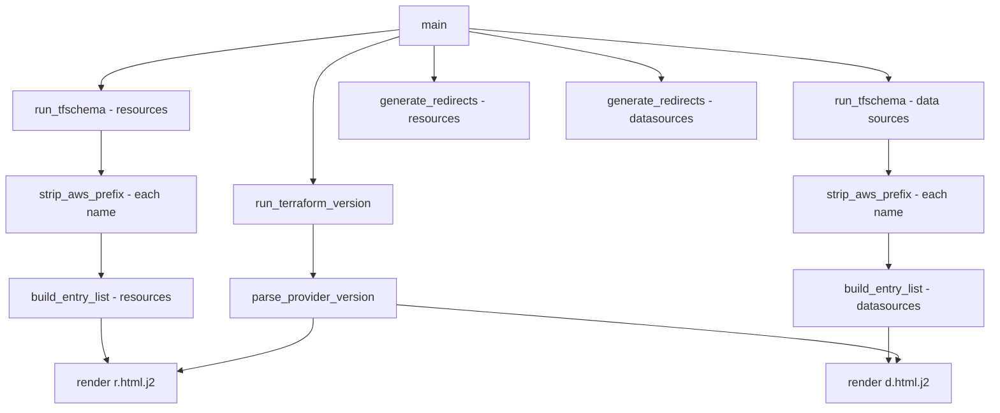

# Design Document

## Overview

This feature extends the existing redirect generator (`src/generate/cli.py`) to render the index/listing templates (`r.html.j2` and `d.html.j2`) with fully populated template variables. Currently the generator only renders `redirect.html.j2` for individual per-resource redirect pages. After this change, it will also render the two listing pages that show all resources or data sources, passing:

* A `provider_version` string extracted from `terraform --version` output
* A `resources` list of `Resource_Entry` objects (for `r.html.j2`)
* A `datasources` list of `Datasource_Entry` objects (for `d.html.j2`)

The design follows the existing patterns in `cli.py`: subprocess execution with timeout/error handling, prefix stripping, URL construction, and Jinja2 template rendering.

## Architecture

The system remains a single-module CLI application. The new functionality adds:

1. A `run_terraform_version()` function that executes `terraform --version` and returns raw output
2. A `parse_provider_version()` pure function that extracts the AWS provider version from the output string
3. A `build_entry_list()` function that converts stripped names into entry objects
4. Integration into `main()` to load the two additional templates and render them



## Components and interfaces

### `run_terraform_version(timeout: int = 30) -> str`

Executes `terraform --version` as a subprocess, captures stdout, and returns the raw output string. Handles the same error conditions as `run_tfschema`:

* `FileNotFoundError` → print error to stderr, `sys.exit(1)`
* `subprocess.TimeoutExpired` → print error to stderr, `sys.exit(1)`
* Non-zero return code → print error to stderr, `sys.exit(1)`

### `parse_provider_version(output: str) -> str | None`

Pure function that parses the raw `terraform --version` output string. Searches for a line matching:

```text
+ provider registry.terraform.io/hashicorp/aws v<major>.<minor>.<patch>
```

Returns the version string (e.g., `"6.52.0"`) without the `v` prefix, or `None` if no match is found. Uses only the first matching line.

### `build_entry_list(stripped_names: list[str], original_names: list[str], category: str) -> list[dict[str, str]]`

Constructs a list of entry dictionaries from parallel lists of stripped and original names. Each entry has:

* `href`: the full Terraform Registry URL (using `build_target_url`)
* `full_name`: the original `aws_`-prefixed name

The `category` parameter is `"resources"` or `"data-sources"`, passed through to `build_target_url`.

### `render_index_template(env: Environment, template_name: str, output_path: Path, context: dict[str, object]) -> None`

Loads a named template from the Jinja2 environment, renders it with the provided context dict, and writes the result to `output_path`. Creates parent directories as needed. Exits on template-not-found or filesystem errors.

### Updated `main()` flow

1. Fetch resources and data sources via `run_tfschema` (existing)
2. Strip prefixes (existing)
3. Run `terraform --version` and parse provider version (new)
4. Build entry lists for resources and data sources (new)
5. Clean output directories (existing)
6. Load templates — `redirect.html.j2`, `r.html.j2`, `d.html.j2` (expanded)
7. Generate individual redirects (existing)
8. Render `r.html.j2` → `docs/r/index.html` (new)
9. Render `d.html.j2` → `docs/d/index.html` (new)
10. Print summary (updated to include index pages)

## Data models

### `Resource_Entry` / `Datasource_Entry`

Both are dictionaries with the same shape, passed directly to Jinja2 templates:

```python
entry: dict[str, str] = {
    "href": "https://registry.terraform.io/providers/hashicorp/aws/latest/docs/resources/instance",
    "full_name": "aws_instance",
}
```

Using plain dicts keeps the interface simple and matches how Jinja2 consumes template variables. The templates iterate over these with `{{ resource.href }}` and `{{ resource.full_name }}`.

### Template context for `r.html.j2`

```python
context: dict[str, object] = {
    "provider_version": "6.52.0",
    "resources": [
        {"href": "https://...", "full_name": "aws_instance"},
        # ...
    ],
    "target_url": "https://registry.terraform.io/providers/hashicorp/aws/latest/docs",
    "original_name": "aws",
    "stripped_name": "aws",
}
```

### Template context for `d.html.j2`

```python
context: dict[str, object] = {
    "provider_version": "6.52.0",
    "datasources": [
        {"href": "https://...", "full_name": "aws_ami"},
        # ...
    ],
    "target_url": "https://registry.terraform.io/providers/hashicorp/aws/latest/docs",
    "original_name": "aws",
    "stripped_name": "aws",
}
```

### `terraform --version` output format

```text
Terraform v1.15.1
on darwin_arm64
+ provider registry.terraform.io/hashicorp/aws v6.52.0
```

The regex pattern used for extraction:

```python
r"\+\s+provider\s+registry\.terraform\.io/hashicorp/aws\s+v(\d+\.\d+\.\d+)"
```

## Correctness properties

_A property is a characteristic or behavior that should hold true across all valid executions of a system — essentially, a formal statement about what the system should do. Properties serve as the bridge between human-readable specifications and machine-verifiable correctness guarantees._

### Property 1: version extraction round-trip

_For any_ three non-negative integers (major, minor, patch), if a `terraform --version` output string contains the line `+ provider registry.terraform.io/hashicorp/aws v<major>.<minor>.<patch>`, then `parse_provider_version` shall return the string `"<major>.<minor>.<patch>"` with the `v` prefix removed.

**Validates: Requirements 1.1, 6.1.**

### Property 2: non-matching output returns none

_For any_ multi-line string that does not contain a line matching the pattern `+ provider registry.terraform.io/hashicorp/aws v<digits>.<digits>.<digits>`, `parse_provider_version` shall return `None`.

**Validates: Requirements 1.4, 6.2.**

### Property 3: first match wins for multiple provider lines

_For any_ `terraform --version` output containing two or more lines matching the `hashicorp/aws` provider pattern with distinct version strings, `parse_provider_version` shall return the version from the first matching line only.

**Validates: Requirements 1.2, 6.3.**

### Property 4: entry list preserves input order

_For any_ list of valid resource or data source names and either category (`"resources"` or `"data-sources"`), `build_entry_list` shall produce an output list whose elements appear in the same order as the input names.

**Validates: Requirements 2.1, 3.1.**

### Property 5: entry fields are correctly constructed

_For any_ valid name (with or without `aws_` prefix) and either category, each entry produced by `build_entry_list` shall have an `href` equal to `build_target_url(stripped_name, category)` and a `full_name` equal to the original input name.

**Validates: Requirements 2.2, 2.3, 2.5, 3.2, 3.3, 3.5.**

## Error handling

| Condition                                 | Behavior                                 | Exit code |
|-------------------------------------------|------------------------------------------|-----------|
| `terraform` not found on PATH             | Print error to stderr                    | 1         |
| `terraform --version` times out (30s)     | Print timeout error to stderr            | 1         |
| `terraform --version` non-zero exit       | Print command failure to stderr          | 1         |
| No `hashicorp/aws` provider in output     | Print missing provider error to stderr   | 1         |
| `r.html.j2` or `d.html.j2` not found      | Print template-not-found to stderr       | 1         |
| Template render failure (syntax/variable) | Print rendering error to stderr          | 1         |
| Filesystem write failure for index files  | Print write error to stderr              | 1         |
| Empty resources or datasources list       | Render template normally (empty listing) | 0         |

Error messages follow the existing pattern in `cli.py`: `"Error: <description>"` printed to stderr via `print(..., file=sys.stderr)`.

The `run_terraform_version` function mirrors the error handling structure of `run_tfschema` — wrapping `subprocess.run` in a try/except for `FileNotFoundError` and `subprocess.TimeoutExpired`, then checking `returncode`.

## Testing strategy

### Unit tests (example-based)

* `run_terraform_version` error conditions: `FileNotFoundError`, timeout, non-zero exit code (Requirements 1.3, 1.5, 1.6)
* Template-not-found error handling (Requirements 4.3, 5.3)
* Template render failure handling (Requirement 5.4)
* Filesystem write failure handling (Requirements 4.4, 5.5)
* Empty resources list still renders (Requirement 4.5)

### Property-based tests (Hypothesis)

Each property test runs a minimum of 100 iterations and references its design property.

* **Property 1** — Version extraction round-trip: Generate random (major, minor, patch) tuples as non-negative integers, format into realistic `terraform --version` output, verify `parse_provider_version` returns the exact `"major.minor.patch"` string.
  * Tag: `Feature: template-variables, Property 1: Version extraction round-trip`

* **Property 2** — Non-matching output returns None: Generate random multi-line strings filtered to exclude the provider pattern, verify `parse_provider_version` returns `None`.
  * Tag: `Feature: template-variables, Property 2: Non-matching output returns None`

* **Property 3** — First match wins: Generate two distinct version tuples, embed both in output, verify the first version is returned.
  * Tag: `Feature: template-variables, Property 3: First match wins for multiple provider lines`

* **Property 4** — Order preservation: Generate random lists of valid resource names, pass through `build_entry_list`, verify output indices match input indices.
  * Tag: `Feature: template-variables, Property 4: Entry list preserves input order`

* **Property 5** — Entry field correctness: Generate random names (with and without `aws_` prefix) and random category, verify `href` and `full_name` fields match expected values.
  * Tag: `Feature: template-variables, Property 5: Entry fields are correctly constructed`

### Integration tests

* End-to-end test with mocked `tfschema` and `terraform --version` output, verifying:
  * `docs/r/index.html` and `docs/d/index.html` are created
  * Rendered HTML contains the provider version
  * Rendered HTML contains resource/datasource entries with correct hrefs
  * Individual redirect files are still generated correctly

### Testing library

* **Property-based testing**: Hypothesis (already in dev dependencies at `>=6.155.7`)
* **Test runner**: pytest (already in dev dependencies)
* **Configuration**: Each property test uses `@settings(max_examples=100)`
