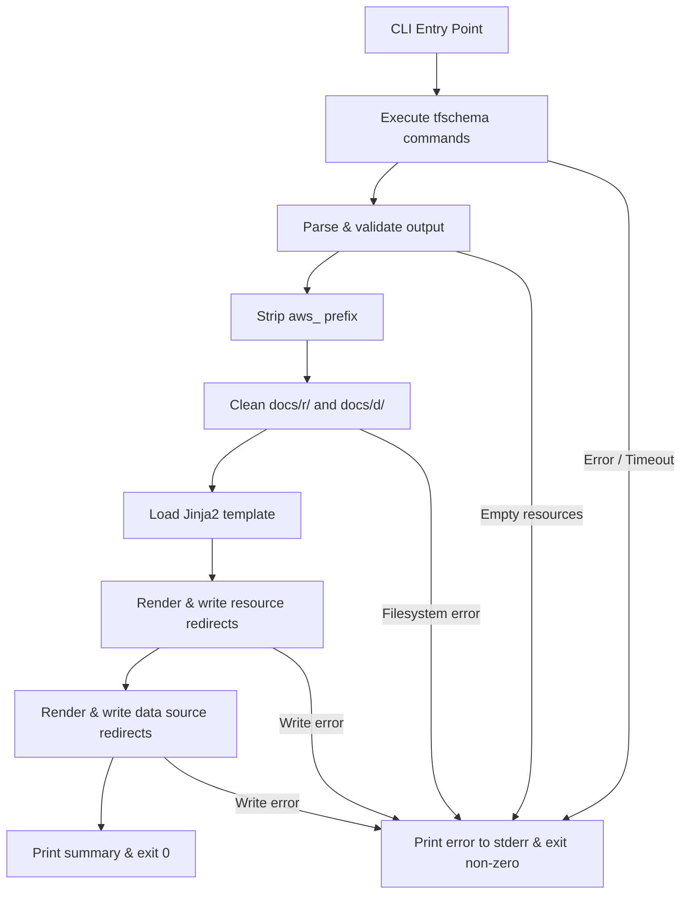

# Design Document

## Overview

The Terraform Registry Redirects generator is a Python CLI tool that produces static HTML redirect pages for every AWS provider resource and data source listed by `tfschema`. The tool creates short, memorable URLs (e.g., `/r/instance`, `/d/ami`) that redirect to the canonical Terraform Registry documentation pages.

The generator follows a straightforward pipeline:

1. Execute `tfschema` commands to collect resource and data source type names.
2. Parse the output into clean lists, stripping whitespace and discarding empty lines.
3. Strip the `aws_` prefix from each type name to derive short path segments.
4. Clean the output directories (`docs/r/`, `docs/d/`) to remove stale redirects.
5. Render Jinja2 templates for each entry and write them as `index.html` files.
6. Print a summary and exit.

## Architecture

The system uses a single-pass pipeline architecture with no concurrency requirements. All operations are sequential and the tool exits after one run.



**Design decisions:**

* **Single module (`cli.py`)**: The application is small enough to live in one file. The `main()` function orchestrates the pipeline while helper functions handle discrete steps.
* **No concurrency**: `tfschema` runs fast locally and there are typically ~1200 entries. Sequential file writes complete in under a second.
* **Fail-fast on errors**: Any filesystem or command failure aborts immediately. Partial output is acceptable because the clean step runs first — the user simply re-runs.

## Components and interfaces

### `main() -> int`

Entry point registered via `pyproject.toml` console script. Orchestrates the full pipeline and returns the exit code.

### `run_tfschema(args: list[str], timeout: int = 30) -> list[str]`

Executes a `tfschema` subcommand, captures stdout, and returns parsed lines. Raises `SystemExit` on command failure, timeout, or missing executable.

**Parameters:**

* `args` — arguments to pass after `tfschema` (e.g., `["resource", "list", "aws"]`).
* `timeout` — maximum seconds to wait (default 30).

**Returns:** List of non-empty, stripped lines from stdout.

### `strip_aws_prefix(name: str) -> str | None`

Strips the leading `aws_` prefix from a type name. Returns `None` if stripping would produce an empty string, logging a warning.

**Parameters:**

* `name` — the full Terraform type name (e.g., `aws_instance`).

**Returns:** The stripped name (e.g., `instance`) or `None` for invalid entries.

### `clean_output_dirs(base: Path) -> None`

Removes all contents of `docs/r/` and `docs/d/` under `base`. Silently skips directories that do not exist. Raises `SystemExit` on filesystem errors.

### `generate_redirects(names: list[str], category: str, template: Template, base: Path) -> int`

Renders and writes redirect HTML files for a list of stripped names.

**Parameters:**

* `names` — list of stripped type names.
* `category` — either `"resources"` or `"data-sources"` (used in the registry URL path).
* `template` — a compiled Jinja2 `Template` object.
* `base` — the project root path (files written under `base/docs/`).

**Returns:** The count of files written.

### `build_target_url(stripped_name: str, category: str) -> str`

Constructs the full Terraform Registry URL for a given name and category.

**Parameters:**

* `stripped_name` — the name with `aws_` removed.
* `category` — `"resources"` or `"data-sources"`.

**Returns:** Full URL string, e.g., `https://registry.terraform.io/providers/hashicorp/aws/latest/docs/resources/instance`.

## Data models

This application operates on simple string data and does not require dataclasses or complex models. The key data structures are:

| Concept            | Type             | Description                                          |
|--------------------|------------------|------------------------------------------------------|
| Resource list      | `list[str]`      | Raw type names from `tfschema resource list aws`     |
| Data source list   | `list[str]`      | Raw type names from `tfschema data list aws`         |
| Stripped name      | `str`            | Type name with `aws_` prefix removed                 |
| Target URL         | `str`            | Full Terraform Registry documentation URL            |
| Template variables | `dict[str, str]` | Keys: `target_url`, `original_name`, `stripped_name` |

### URL construction

```text
Registry_Base_URL = https://registry.terraform.io/providers/hashicorp/aws/latest/docs

Resource URL  = {Registry_Base_URL}/resources/{stripped_name}
Data Source URL = {Registry_Base_URL}/data-sources/{stripped_name}
```

### File path construction

```text
Resource path    = docs/r/{stripped_name}/index.html
Data source path = docs/d/{stripped_name}/index.html
```

### Jinja2 template location

```text
src/generate/templates/redirect.html.j2
```

Template receives: `target_url`, `original_name`, `stripped_name`.

## Correctness properties

_A property is a characteristic or behavior that should hold true across all valid executions of a system — essentially, a formal statement about what the system should do. Properties serve as the bridge between human-readable specifications and machine-verifiable correctness guarantees._

### Property 1: line parsing preserves non-empty content and strips whitespace

_For any_ multi-line string input, parsing it as a newline-delimited list shall produce a result where every entry is non-empty, contains no leading or trailing whitespace, and no non-whitespace content from the original input is lost.

**Validates: Requirements 1.2, 2.2**

### Property 2: prefix stripping correctness

_For any_ string that starts with `aws_` followed by one or more characters, stripping the prefix shall produce the exact substring after `aws_`. _For any_ string that does not start with `aws_`, stripping shall return the string unchanged.

**Validates: Requirements 3.1, 3.2, 3.3**

### Property 3: URL construction follows registry pattern

_For any_ valid stripped name and category (either `"resources"` or `"data-sources"`), `build_target_url` shall produce a URL equal to `https://registry.terraform.io/providers/hashicorp/aws/latest/docs/{category}/{stripped_name}`.

**Validates: Requirements 4.2, 5.2**

### Property 4: template rendering produces complete HTML structure

_For any_ valid target URL, original name, and stripped name, rendering the redirect template shall produce output that contains: a `<!DOCTYPE html>` declaration, an `<html lang="en">` element, a `<meta charset="UTF-8">` tag, a `<meta http-equiv="refresh" content="0;URL='{target_url}'">` tag, a `<link rel="canonical" href="{target_url}">` tag, a `<title>` element with non-empty text, and a `<body>` containing an `<a>` element whose `href` equals the target URL with non-empty link text.

**Validates: Requirements 4.2, 4.3, 5.2, 5.3, 6.1, 6.2, 6.3, 6.4, 6.5, 9.2, 9.3**

### Property 5: file path construction

_For any_ stripped resource name, the output file path shall be `docs/r/{name}/index.html`. _For any_ stripped data source name, the output file path shall be `docs/d/{name}/index.html`.

**Validates: Requirements 4.1, 5.1**

### Property 6: summary line contains correct counts

_For any_ pair of non-negative integers representing resource count and data source count, the summary output line shall contain both numeric values as distinct substrings.

**Validates: Requirements 8.3**

## Error handling

All errors follow a fail-fast pattern. The generator writes to `stderr` and exits with a non-zero status immediately upon encountering an unrecoverable error.

| Error condition                           | Behaviour                                             | Exit code     |
|-------------------------------------------|-------------------------------------------------------|---------------|
| `tfschema` not found on PATH              | Print error naming the missing executable to stderr   | Non-zero      |
| `tfschema` returns non-zero exit code     | Print error with command name and exit code to stderr | Non-zero      |
| `tfschema` times out (>30s)               | Kill process, print timeout error to stderr           | Non-zero      |
| Resource list is empty after parsing      | Print warning to stderr                               | Non-zero      |
| Data source list is empty after parsing   | Print warning to stderr, continue with empty list     | 0 (continues) |
| `aws_` prefix strip yields empty string   | Log warning to stderr, skip entry, continue           | 0 (continues) |
| Filesystem error during directory cleanup | Print error to stderr                                 | Non-zero      |
| Filesystem error writing a redirect file  | Print error to stderr                                 | Non-zero      |
| Jinja2 template fails to load or render   | Print error to stderr                                 | Non-zero      |

**Design decisions:**

* Empty resource list is fatal (Req 1.5) because the tool's primary purpose is resource redirects — an empty list likely indicates a broken `tfschema` installation.
* Empty data source list is non-fatal (Req 2.5) to allow partial generation if only data sources are unavailable.
* All error messages include enough context to diagnose the issue (command name, exit code, file path, etc.).

## Testing strategy

### Unit tests (example-based)

Unit tests cover specific scenarios, error paths, and edge cases:

* **Command execution errors**: Mock `subprocess.run` to simulate non-zero exit codes, `FileNotFoundError`, and `TimeoutExpired`.
* **Empty output handling**: Verify the distinction between resource (fatal) and data source (non-fatal) empty lists.
* **Edge case — `aws_` only**: Verify the entry is skipped with a warning.
* **Filesystem errors**: Mock `shutil.rmtree` and file write operations to verify error reporting.
* **Template load failures**: Mock Jinja2 `Environment` to raise `TemplateNotFound`.
* **Directory preservation**: Verify `docs/404.html`, `docs/.nojekyll`, and `docs/CNAME` survive cleanup.

### Property-based tests (Hypothesis)

Property-based tests validate universal correctness properties using the [Hypothesis](https://hypothesis.readthedocs.io/) library.

**Configuration:**

* Minimum 100 examples per property test.
* Each test tagged with: `# Feature: terraform-registry-redirects, Property {N}: {description}`

**Properties to test:**

1. Line parsing — generate random multi-line strings with whitespace variations.
2. Prefix stripping — generate random strings with and without `aws_` prefix.
3. URL construction — generate random alphanumeric names and categories.
4. Template rendering — generate random valid inputs, render, and verify HTML structure.
5. File path construction — generate random names, verify path pattern.
6. Summary formatting — generate random count pairs, verify both appear.

**Testing library:** `hypothesis` (added as a dev dependency via `uv add --dev hypothesis pytest`).

### Integration tests

* End-to-end run with mocked `tfschema` output verifying file creation and content.
* Verify `uv run generate` entry point resolves correctly.
